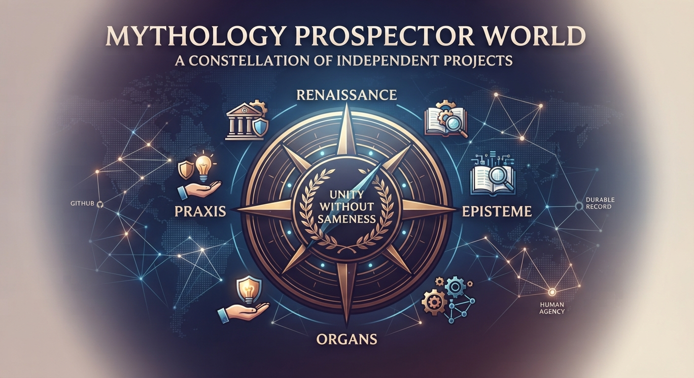

# Mythology Prospector World

> The durable landing point for the mythologyprospector-hub project world.

This repository is the **world-level orientation layer**.

It does not own the internal architecture of the projects it maps. Each project remains sovereign and keeps its own canon, architecture, tests, and decisions.

## Start here

1. [GENIE_PROTOCOL.md](GENIE_PROTOCOL.md) — the three-wish method: learn how to ask, give the wish a durable home, then drive the work.
2. [HANDOFF.md](HANDOFF.md) — fresh-agent arrival protocol.
3. [WORLD.md](WORLD.md) — what this world is.
4. [WORKFLOW.md](WORKFLOW.md) — how work is conducted.
5. [REPOSITORIES.md](REPOSITORIES.md) — current project map.
6. [MACHINE.md](MACHINE.md) — local development layout.

Then enter the relevant project's own repository and read its canonical documents before changing anything.

## Governing idea

**The whole GitHub world is the unit of orientation. Individual repositories are the units of ownership and implementation.**

The world map tells an agent where to look. Project canon tells it what is true inside that project.

## Authority

This repository is authoritative for **world-level orientation and workflow only**.

It must never silently override a project's own canon.
